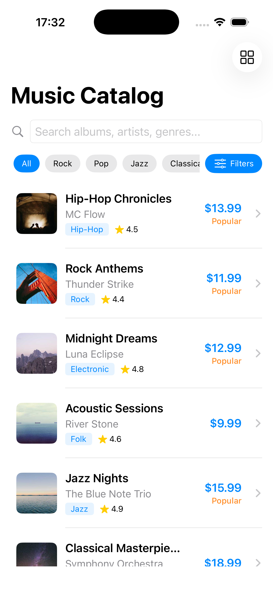
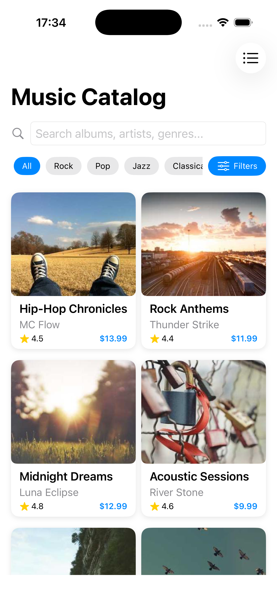
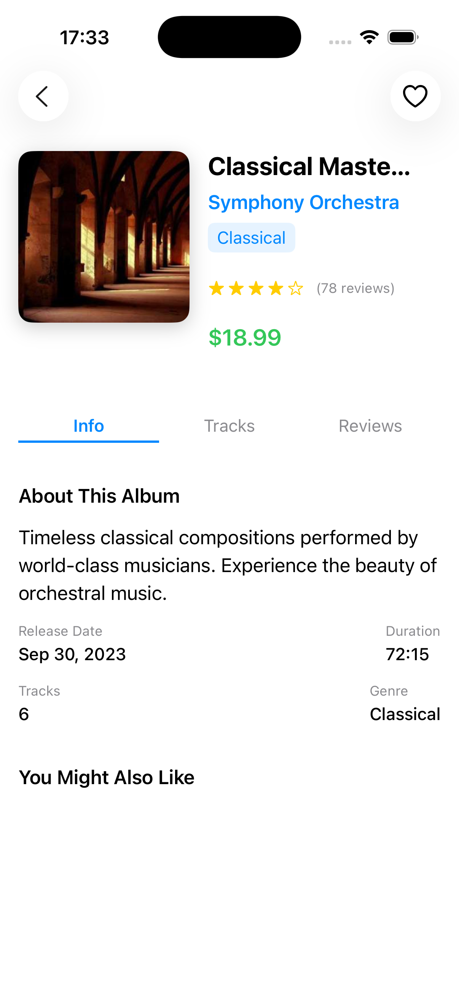
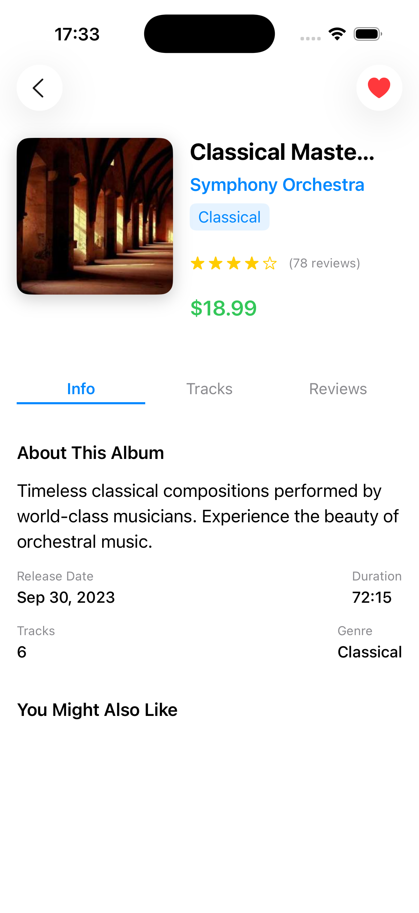
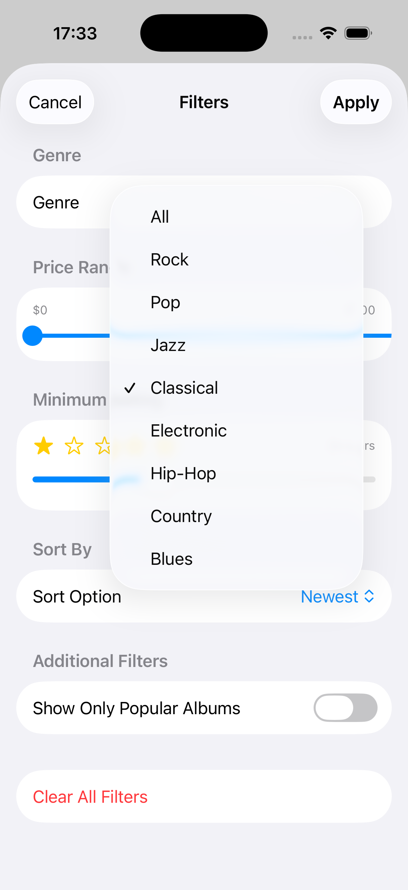
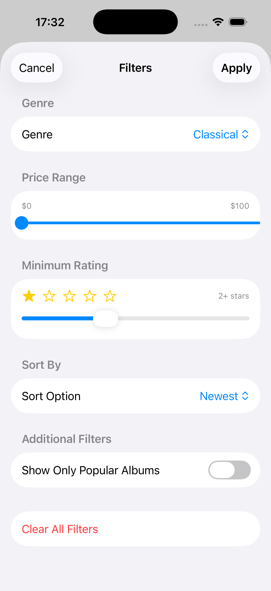

# Music Catalog App

An iOS music catalog app built with SwiftUI and UIKit featuring an Apple Music-inspired design.

## Features

- **Music Catalog**: Browse through a curated collection of albums and artists
- **Search & Filter**: Advanced search functionality with genre and country filtering
- **Album Details**: Detailed album view with related albums and purchase options
- **Artist Profiles**: Comprehensive artist information with bio and discography
- **Apple Music Style UI**: Modern, clean interface inspired by Apple Music design
- **High-Quality Images**: Music-themed album covers and artist photos

## Screenshots

<!-- Main Catalog Screen -->
<h3>Music Catalog Screen</h3>



<!-- Album Detail Screen -->
<h3>Album Detail Screen</h3>



<!-- Search and Filter -->
<h3>Filter Options</h3>


<!-- Settings Screen -->
<h3>Settings Screen</h3>


The app provides a comprehensive music browsing experience including:
- Intuitive album and artist browsing
- Advanced search and filtering capabilities
- Detailed album information with pricing
- Related album recommendations
- Artist biographies and profiles

## Installation

### Prerequisites
- Xcode 14.0 or later
- iOS 15.0 or later
- macOS 12.0 or later

### Setup Instructions

1. Clone the repository:
```bash
git clone https://github.com/blackhat955/Catalog_App.git
cd Catalog_App
```

2. Open the project in Xcode:
```bash
open "Catalog App.xcodeproj"
```

3. Build and run the project:
   - Select your target device or simulator
   - Press `Cmd + R` to build and run

## Tech Stack

- **SwiftUI**: Modern declarative UI framework
- **Combine**: Reactive programming for data binding
- **MVVM Architecture**: Clean separation of concerns
- **JSON Data**: Local data storage for albums and artists
- **AsyncImage**: Efficient image loading and caching
- **Custom Components**: Reusable UI components

## Project Structure

```
Catalog App/
├── Catalog_AppApp.swift          # App entry point
├── ContentView.swift             # Main content view
├── Data/
│   ├── albums.json              # Album data with Apple Music style images
│   └── artists.json             # Artist data with professional photos
├── Models/
│   └── MusicModels.swift        # Data models for Album and Artist
├── ViewModels/
│   └── MusicCatalogViewModel.swift # Business logic and data management
├── Views/
│   ├── MusicCatalogView.swift   # Main catalog interface
│   ├── AlbumDetailView.swift    # Detailed album view
│   └── FilterSheetView.swift    # Search and filter interface
├── UIKit Components/
│   └── CustomSearchController.swift # Custom search functionality
└── Assets.xcassets/             # App icons and assets
```

## Key Features Breakdown

### Music Catalog
- Grid and list view options
- Smooth scrolling performance
- Album artwork with lazy loading
- Price display and ratings

### Search & Filter
- Real-time search functionality
- Filter by genre (Pop, Rock, Jazz, Electronic, etc.)
- Filter by country/region
- Combined search and filter capabilities

### Album Details
- High-resolution album artwork
- Track information and pricing
- Related album recommendations
- Artist information integration

### Artist Profiles
- Professional artist photos
- Detailed biographies
- Genre and country information
- Discography integration

## Data Structure

The app uses JSON files for data storage:

- **albums.json**: Contains album information including titles, artists, genres, prices, ratings, and Apple Music style cover images
- **artists.json**: Contains artist profiles with biographies, genres, countries, and professional portrait photos


## Contributing

1. Fork the repository
2. Create your feature branch (`git checkout -b feature/AmazingFeature`)
3. Commit your changes (`git commit -m 'Add some AmazingFeature'`)
4. Push to the branch (`git push origin feature/AmazingFeature`)
5. Open a Pull Request

## License

This project is available for educational and personal use.

